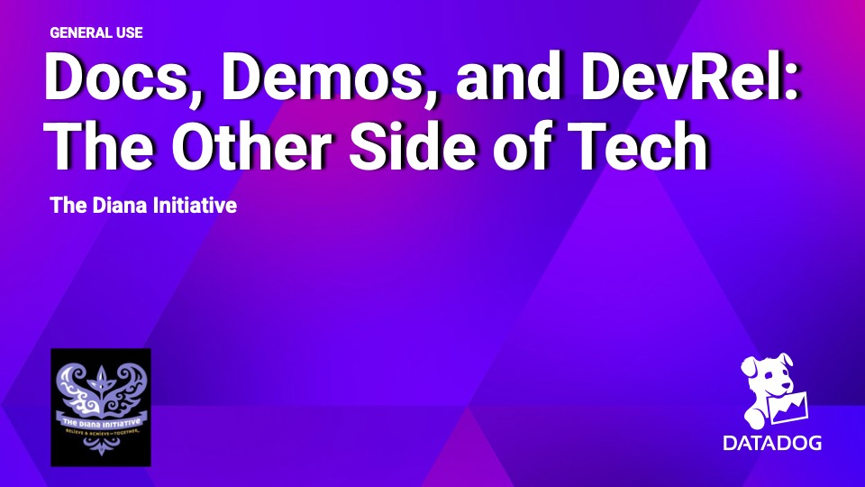

# The Diana Initiative 2025 - Docs, Demos, and DevRel: The Other Side of Tech

## Presentation Resources
- [Slides](Docs_Demos_and_DevRel.pdf)
- [The Diana Initiative Website](https://www.dianainitiative.org/home)

## Abstract
When we think about career growth in tech, the choice often seems binary: stay on the individual contributor track as an engineer or move into management. Both are valid and valuable paths, but they’re not the only ones. Behind every great product are teams of technical writers, advocates, and curriculum developers who bridge the gap between security and community. These roles may be less visible, but they are filled with highly technical professionals, many of whom have spent most of their careers as engineers.

This session will share how these alternative career paths offer opportunities to stay deeply technical while leaning into strengths like communication, education, and storytelling. Whether it’s writing docs that accelerate adoption, creating learning content that upskills users, or sharing research, these roles play a critical part in a product company’s success.

## Supporting Resources
- [LEADERSHIP LAB: The Craft of Writing Effectively](https://www.youtube.com/watch?v=vtIzMaLkCaM&t=310s)
- [Writing Advice from Matt Stone & Trey Parker @ NYU | MTVU's "Stand In"](https://youtu.be/vGUNqq3jVLg)
- [Google Technical Writing](https://developers.google.com/tech-writing)
- [How to Make Better Infosec Presentation Slides](https://medium.com/katies-five-cents/how-to-make-better-infosec-presentation-slides-f3dd59ae4263)
- [11 Presentation Lessons You Can Still Learn From Steve Jobs](https://www.forbes.com/sites/carminegallo/2012/10/04/11-presentation-lessons-you-can-still-learn-from-steve-jobs/)
- [Pixar Storytelling Rules](https://industrialscripts.com/pixar-storytelling-rules/)
